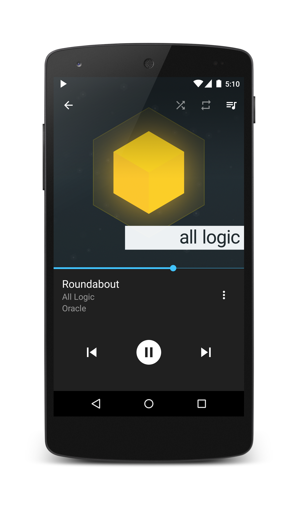
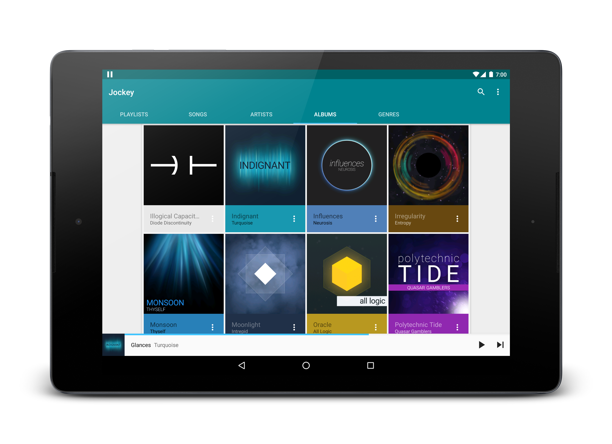

# Jockey
Jockey is a music player for Android based on Google's Material Design standards. The point of Jockey is to be a simple, lightweight media player with features designed for music enthusiasts and casual listeners alike. Currently Jockey is notably lacking a few enthusiast features like gapless playback, crossfade and replay gain which may be added in the future.

  

### Downloads
You can get Jockey on [Google Play](https://play.google.com/store/apps/details?id=com.marverenic.music), or you can install it manually. If you decide to sideload Jockey, you cab download compiled versions of Jockey from the [build branch](https://github.com/marverenic/Jockey/tree/build).  
In order to install compiled APK's, you will need to enable installation of applications from third party sources if you haven't already done so, and then sideload the APK. There are many guides available online that demonstrate this process in detail.

### Permissions
#### Android 6.0 and higher
**Storage**  
Jockey needs permission to Storage so that it can scan for music and play songs. Without this permission, Jockey can't work and will just kind of stare at you passive-aggressively until you grant this permission
#### Android 5.1 and lower
**Read and write to external storage**  
Used to save local data; primarily used for Last.fm cache, library storage, and other small miscellaneous files.  
**Internet**  
Used to retrieve information and thumbnails for artists from Last.fm and upload anonymous usage and crash data with Crashlytics  
**Network State**  
Used to prevent Jockey from using mobile data (if this preference is enabled)  
**Keep awake**  
Used to play music while the device's screen is off  
**Install shortcuts**  
Allows Jockey to (optionally) add shortcuts to Jockey to the launcher. This is only done when explicitly requested from the settings page and is intended so that the launcher icon matches the chosen theme

### Setting up the project
 - Download, install and launch [Android Studio]
 - Clone the repository
 - In Android Studio, select "Import Project..." from the file menu
 - Select Jockey's repository that you just cloned
 - Wait while Gradle begins to build the project (Android Studio may need to restart)

*Note:* To get Jockey to compile, you'll need to either setup Crashlytics using your own API key, or remove the dependency and all logging calls. You can specify your own API key by making a new file in `app/fabric.properties` and add the following lines:  
>`apiSecret="yourApiSecret"`  
>`apiKey="yourApiKey"`

### Bugs & contributing
Feel free to post suggestions, crashes, or just anything that isn't as smooth as it should be to the bug tracker -- I want Jockey to be as seamless as it possibly can. Additionally, don't hesitate to fork Jockey or submit a pull request -- especially if it's a bug fix or cleans up code that's doing mischievous things that I'm not aware of like planning world domination.

### License
Jockey is licensed under an Apache 2.0 license

[Android Studio]:http://developer.android.com/sdk/index.html